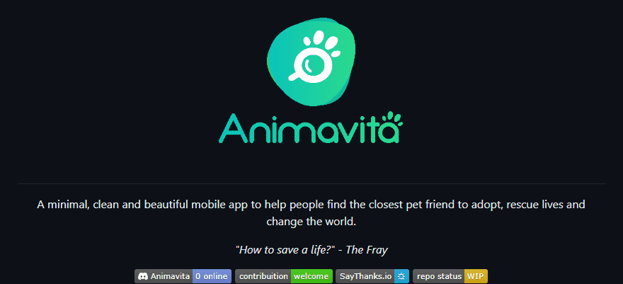

<!-- Título -->
# Projeto com README

<!-- Descrição -->
Um projeto de teste com um rquivo README 🚀

<!-- Inserindo um GIF, através do ScreenToGif -->
[](https://google.com)

<!-- Sessão de Subtítulo com marcadores de lista -->
## Tecnologias utilizadas

- HTML
- CSS
- JS

<!-- Sessão de SubTítulo com códigos -->
## Como utilizar

1 - Clone para o projeto
```
git clone <url>
```

2 - Acesse a pasta do projeto
```
cd repositorio-com-readme
```

